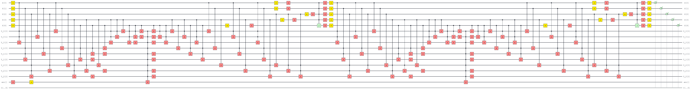

# Table of Contents
- [Introduction](#introduction)
- [Features](#features)
  - [Sudoku Puzzles](#sudoku-puzzles)
  - [Quantum Circuit Construction](#quantum-circuit-construction)
  - [Data Generation & Analysis](#data-generation--analysis)
  - [Benchmarking](#benchmarking)
  - [Visualization](#visualization)
- [Architecture](#architecture)
  - [Sudoku Generation](#sudoku-generation)
  - [Quantum Circuit Construction](#quantum-circuit-construction-1)
- [Encoding Methods](#encoding-methods)
- [Data Analysis & Benchmarking](#data-analysis--benchmarking)
  - [Metrics Collected](#metrics-collected)
  - [Benchmark on IBM Backend](#benchmark-on-ibm-backend)
- [Demo](#demo)
- [Installation](#installation)
  - [Prerequisites](#prerequisites)
  - [Steps](#steps)
- [Usage](#usage)
  - [Generating a Sudoku Puzzle](#generating-a-sudoku-puzzle)
  - [Constructing a Quantum Circuit](#constructing-a-quantum-circuit)
  - [Running the Benchmark](#running-the-benchmark)
- [Results](#results)
- [Limitations](#limitations)
- [Future Work](#future-work)

## Introduction
This project provides tools to generate customizable Sudoku puzzles, encode them into quantum circuits, and analyze the performance of these circuits both locally and on external backends.

### Features

#### Sudoku Puzzles
- Random puzzle generation with adjustable number of missing cells. through [`sudoku-py`](https://pypi.org/project/sudoku-py/)
- Introduce custom puzzle
- 

#### Quantum Circuit Construction
- Two distinct encoding methods
- Efficient representation of Sudoku constraints

#### Data Generation, Analysis & Visualization
- Generate data for thousands of puzzles
- Collect metrics on quantum resources
- Graphical representation of data analysis results

## Architecture

### Sudoku Generation

The `Sudoku` class is central to the puzzle generation process. It allows you to:

**Initialize and Plot a Puzzle:**

```python
# Initialize a 9x9 puzzle with 30 missing cells
sudoku = Sudoku(grid_size=3, missing_cells=30)
``` 

```python
sudoku.plot()
```

### Quantum Circuit Construction

The quantum circuit aims to solve the puzzle by finding a valid solution through an algorithm based on Grover's. [[Jiang,Wang]](#references)

An exact cover problem is an NP-complete problem in which each element of a given set must be covered exactly once by a subset from a given collection of its subsets. Formally:

Given a set $U$ and a family of subsets $S=\{S_1,\dots,S_n\}\subseteq\mathcal{P}(U)$, find a subfamily $S'\subseteq S$ such that: 
$$
i) \hspace{4pt} \forall \hspace{2pt} S_i, S_j \in S', \hspace{4pt} S_i\cap S_j = \emptyset.
$$
$$
ii) \bigcup_{S_i \in S'} S_i = U
$$

For example, consider the problem:
$$
    U = \{ \textbf{A}, \textbf{B}, \textbf{C} \} 
$$
$$
    S = \bigl\{ S_0 = \{\textbf{A}\}, S_1 = \{\textbf{B}\}, S_2 = \{\textbf{C}\}, S_3 = \{\textbf{A},\textbf{C}\}, S_4 = \{\textbf{A},\textbf{B}\}\bigr\}
$$

Notices that it has three solutions:
$$
    S' =  \bigl\{ S_0 = \{\textbf{A}\}, S_1 = \{\textbf{B}\}, S_2 = \{\textbf{C}\}\}\bigr\}, \\
    S'' =  \bigl\{ S_2 = \{\textbf{C}\}, S_4 = \{\textbf{A},\textbf{B}\}\bigr\}, \\
    S''' =  \bigl\{ S_1 = \{\textbf{B}\}, S_3 = \{\textbf{A},\textbf{C}\}\bigr\}. \\
$$



### Encoding
Encoding Methods:
- Simple encoding. 


Once a Sudoku puzzle is generated, it is encoded into a quantum circuit using one of the two available encoding methods. 


Description of Encoding Type A
Suitable for certain puzzle complexities
Encoding Type B:

Description of Encoding Type B
Optimized for different constraints

Each encoding type impacts the quantum resources required, such as the number of qubits and gates.

Data Analysis & Benchmarking

Metrics Collected

For each generated Sudoku puzzle and each encoding, the following metrics are collected:

- **Number of Qubits.** (*The total number of qubits required to solve the puzzle using* `ExactCoverQuantumSolver`)
- **Number of Multi-Controlled X-Gates.** (*MCX Gates are more complex and resource-intensive*)
- **Total Number of Gates.**


These metrics are gathered for thousands of puzzles across both encoding types, providing a comprehensive dataset for analysis.

#### Benchmark on IBM Backend

A small demo is included to benchmark the solver on the IBM quantum backend. This section discusses the performance results and highlights the current limitations:


## Installation

Steps
Clone the Repository:
```bash
git clone https://github.com/yourusername/sudoku-quantum-solver.git
```

Install dependencies:

```bash
pip install -r requirements.txt
pip install .
```
##### For IBM Backend Test
Configure IBM Quantum Account:

- Sign up at [IBM Quantum Platform](https://quantum.ibm.com/) to get your IBM Quantum API Token.

- Save it using `QiskitRuntimeService`

```python
from qiskit_ibm_runtime import QiskitRuntimeService

QiskitRuntimeService.save_account(channel="ibm_quantum", token='YOUR_IBM_QUANTUM_API_TOKEN', overwrite=True)
```

### Usage

The main class Sudoku can obtain a Sudoku Puzzle for a given grid size and number of missing cells

```python
from sudoku_solver import Sudoku
```

#### Initialize a Sudoku puzzle with 9x9 grid and 30 missing cells
```python
sudoku = Sudoku(size=3, missing_cells=30)
```

```python
sudoku.plot()
```

#### We can introduce a custom puzzle as a matrix

```python
board = [
    [5, 3, 0, 0, 7, 0, 0, 0, 0],
    [6, 0, 0, 1, 9, 5, 0, 0, 0],
    [0, 9, 8, 0, 0, 0, 0, 6, 0],
    [8, 0, 0, 0, 6, 0, 0, 0, 3],
    [4, 0, 0, 8, 0, 3, 0, 0, 1],
    [7, 0, 0, 0, 2, 0, 0, 0, 6],
    [0, 6, 0, 0, 0, 0, 2, 8, 0],
    [0, 0, 0, 4, 1, 9, 0, 0, 5],
    [0, 0, 0, 0, 8, 0, 0, 7, 9]
]

sudoku.custom_board(board):
```

#### Initialize quantum features

```python
sudoku._init_quantum()
```


#### Solution of any exact cover problem with ExactCoverQuantumSolver

```python
from sudoku_solver import ExactCoverQuantumSolver
```

```python
solver = ExactCoverQuantumSolver()
circuit = solver.construct_circuit()
```

#### Data Analysis

This script will generate data for thousands of puzzles, construct their quantum circuits, and collect the necessary metrics.

### Results
Figure 1: Comparison of total gate counts between Encoding Type A and B.

Figure 2: Number of qubits required for different numbers of missing cells.

#### IBM Benchmarking
- Run solver on IBM quantum backend
- Analyze performance and limitations

Performance Insights:

Execution time
Success rate
Resource utilization
Limitations:

The IBM backend did not perform as well as expected, primarily due to [specific reasons, e.g., noise, qubit coherence times, gate fidelity].

Figure 3: Benchmark results on the IBM backend.

The analysis reveals that:

Encoding Type A generally requires fewer qubits but more multi-controlled X-gates.
Encoding Type B optimizes the number of multi-controlled gates at the expense of additional qubits.
The IBM backend struggled with larger circuits due to [specific issues], limiting its practical performance for this application.
### Limitations
While the Sudoku Quantum Solver offers a novel approach to solving Sudoku puzzles using quantum computing, there are several limitations to consider:

- Number of solutions

- IBM Backend Performance:
The IBM quantum backend did not perform as well as expected. Issues such as noise, limited qubit coherence times, and gate fidelity adversely affected the solver's efficiency and accuracy.

- Scalability:
As the number of missing cells increases, the complexity of the quantum circuits grows significantly, requiring more qubits and gates. This scalability issue limits the solver's practicality for very challenging puzzles.

- Encoding Constraints:
The two encoding methods, while effective, have trade-offs between qubit count and gate complexity. Optimizing these encodings further remains an open challenge.

- Resource Requirements:
Running simulations for thousands of puzzles demands substantial computational resources, which might not be feasible for all users.
Current Quantum Hardware Limitations:
The existing quantum hardware is still in its early stages, and its limitations directly impact the performance of quantum-based solvers like this one.

### Future Work

To address the current limitations and enhance the functionality of the Sudoku Quantum Solver, the following areas are proposed for future development:

- Add more sudoku-solving quantum algorithms.

- Improved Encoding Methods:
Develop more efficient encoding schemes to reduce the number of required qubits and gates.
Explore hybrid encoding strategies that combine the strengths of both Encoding Type A and B.

# Possible directions

- Quantum Circuit Optimization:
Implement advanced optimization techniques to minimize circuit depth and gate count.
Utilize compiler optimizations and transpilation strategies specific to target quantum hardware.
Enhanced Benchmarking:

- Extend benchmarking to include other quantum backends beyond IBM, such as those provided by Rigetti or IonQ.
Incorporate error mitigation techniques to improve the accuracy of results on noisy intermediate-scale quantum (NISQ) devices.
Scalability Enhancements:

- Adapt the solver to handle larger Sudoku puzzles or other constraint satisfaction problems.
Investigate parallelization and distributed computing approaches to manage computational loads.

- User Interface Development:

Create a user-friendly interface or dashboard for easier interaction with the solver and visualization of results.
Develop web-based tools to allow users to input puzzles and view solutions without deep technical knowledge.

Community Engagement 

Encourage community contributions by setting up collaborative platforms, such as discussion forums or contribution guidelines.
Host workshops or webinars to demonstrate the solver and gather feedback from users.

Key Points for the Future Work Section:
- Placement: Positioned after the Limitations section to outline potential improvements following the discussion of current constraints.
- Content: Details specific areas where the project can evolve, such as encoding methods, circuit optimization, scalability, user interface enhancements, and community engagement.
- Clarity and Structure: Each future work item is clearly defined, making it easy for contributors and users to understand the proposed directions.
- Encouragement for Contributions: Highlights opportunities for community involvement, fostering collaboration and innovation.
- Final Tips:
Be Specific and Actionable: Clearly define what needs to be done and how it can be achieved. This makes it easier for contributors to take actionable steps.
- Prioritize Tasks: If certain future work items are more critical, consider indicating their priority to guide contributors.
- Align with Project Goals: Ensure that the proposed future work aligns with the overall objectives of the project, maintaining coherence and focus.

# References

###### [Jiang,Wang]
 J. -R. Jiang and Y. -J. Wang, "Quantum Circuit Based on Grover’s Algorithm to Solve Exact Cover Problem," 2023 VTS Asia Pacific Wireless Communications Symposium (APWCS), Tainan city, Taiwan, 2023, pp. 1-5, doi: 10.1109/APWCS60142.2023.10234054.