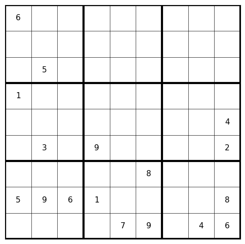
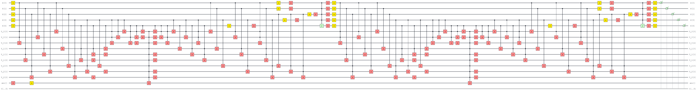
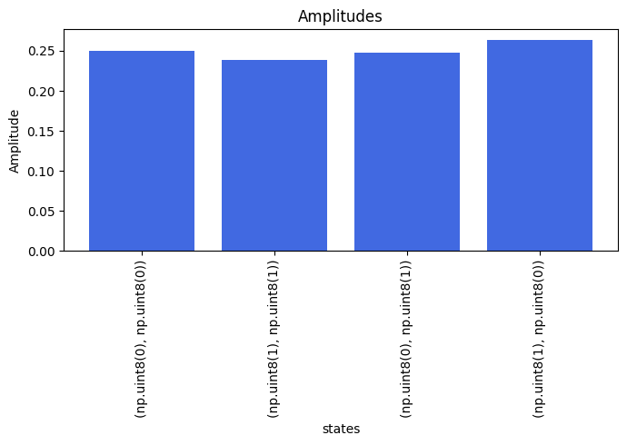
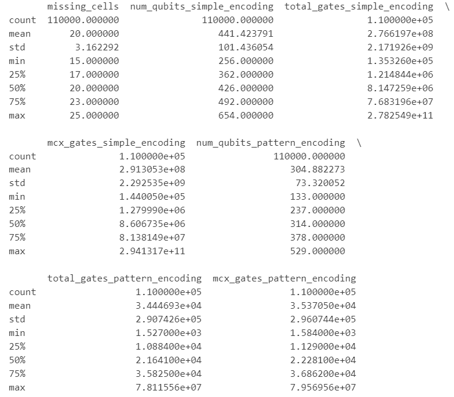
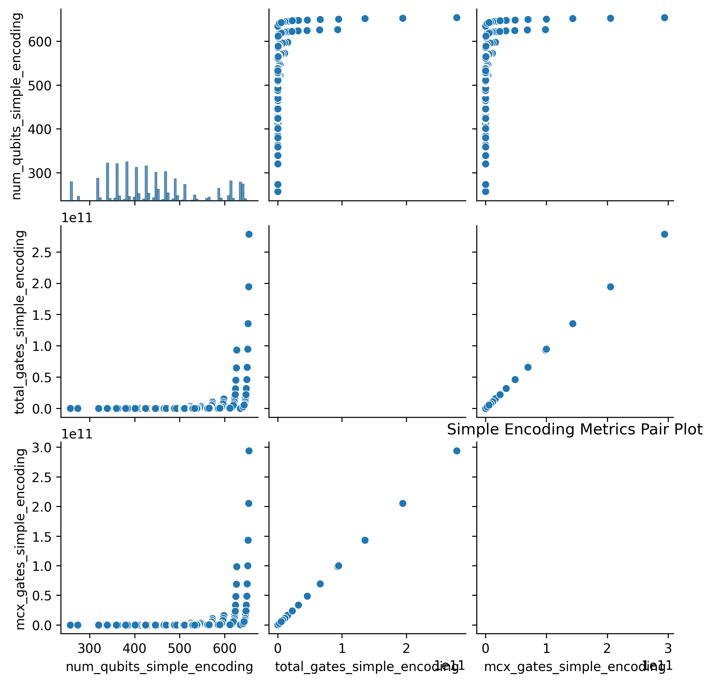
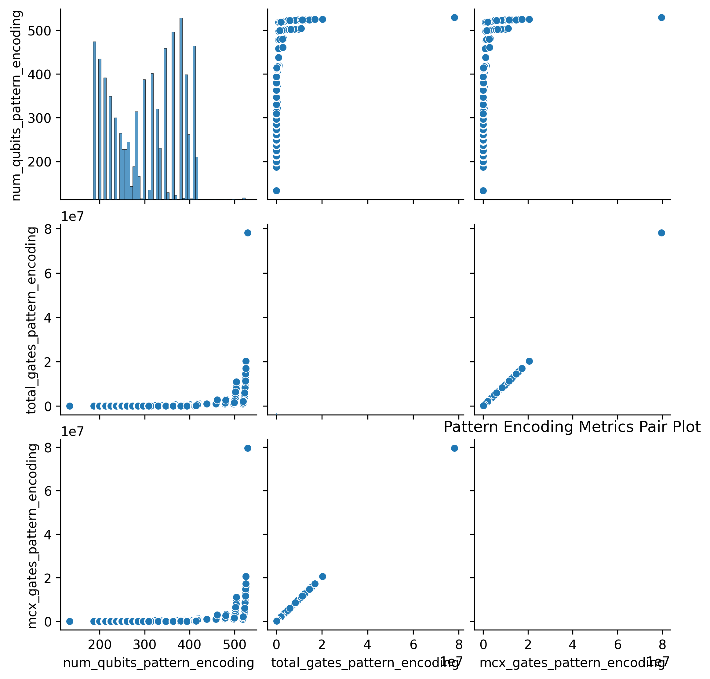
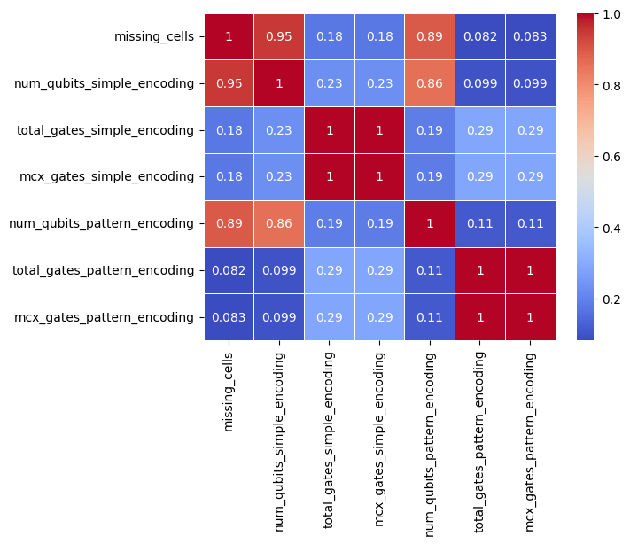
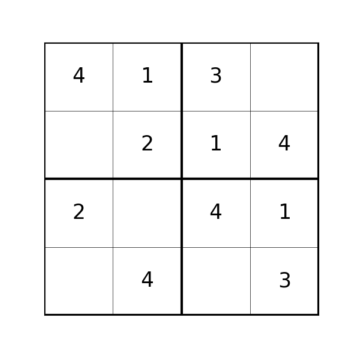
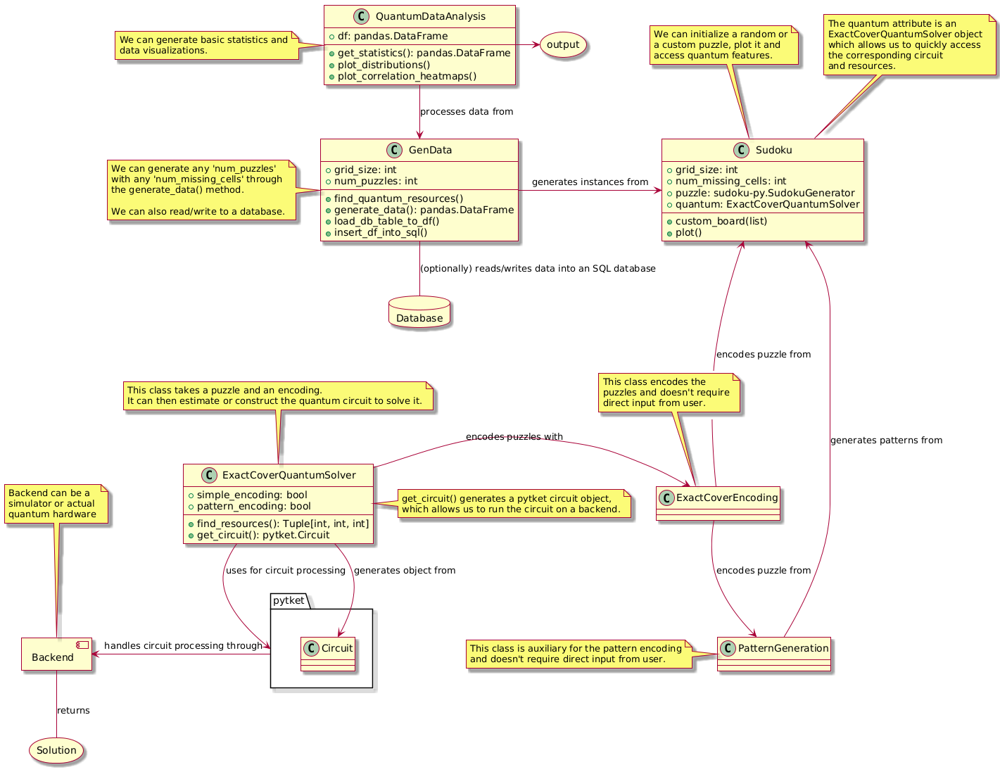

# Sudoku Quantum Solver Framework
## Table of Contents
- [Introduction](#introduction)
- [Features](#features)
  - [Sudoku Puzzles](#sudoku-puzzles)
  - [Quantum Resource Estimation and Circuit Construction](#quantum-resource-estimation-and-circuit-construction)
  - [Data Generation & Analysis](#data-generation--analysis)
- [Basic Usage](#basic-usage)
  - [Sudoku Generation](#sudoku-generation)
  - [Quantum Computation](#quantum-computation)
    - [Benchmark on IBM Backend](#benchmark-on-ibm-backend)
  - [Data Analysis](#data-analysis)
- [Installation](#installation)
  - [Prerequisites](#prerequisites)
  - [Steps](#steps)
- [Quantum Algorithm](#quantum-algorithm)
  - [Puzzle Encoding](#puzzle-encoding)
- [Program Design](#program-design)
- [Current Limitations](#current-limitations)
- [Possible Directions](#possible-directions)
- [References](#references)

## Introduction

This an initial proposal for a framework for **solving Sudoku puzzles on quantum computers** and **providing easy-to-understand benchmarks** to evaluate the capabilities of evolving quantum hardware.

This repository would offer tools for taking custom, or generating random Sudoku puzzles, encoding them into quantum circuits through [`pytket`](https://tket.quantinuum.com/), and executing them on a simulator/external backend (if sufficiently small).

Additionally some features for data analysis are included for generating and examining datasets of Sudoku puzzles and their corresponding quantum resource requirements.

**All content is a work-in-progress**

## Features

#### Sudoku Puzzles
- Random puzzle generation with adjustable number of missing cells through [`sudoku-py`](https://pypi.org/project/sudoku-py/)

#### Quantum Resource Estimation and Circuit Construction
- Given a sudoku puzzle we can build the quantum circuit to solve it.
- We can find the circuit's expected number of qubits, number of multi-controlled-X gates and total number of gates. (Logical resources)

#### Solution on a Backend or a Simulator
- Given the problem size we can transpile the circuit and execute it through a simulator or QPU backend. However, due to the current limitations of quantum hardware, solving even small-sized puzzles remains challenging.

#### Data Generation, Analysis & Visualization
- Generate data for any number of puzzles to collect metrics on quantum resources.
- Graphical representation of data analysis results.

## Basic Usage

*You can also check the [notebooks](https://github.com/RobBEN93/QuantumExactCover-sudoku/tree/master/notebooks)*

### Sudoku Generation

The `Sudoku` class is central to the program.

```python
from python_package.Sudoku import Sudoku
```

 It allows you to:

- Initialize and Plot a Puzzle:

```python
# Initialize a 9x9 puzzle with 64 missing cells
sudoku = Sudoku(grid_size=3, missing_cells=64)
sudoku.plot()
```
*Output:*



- We can also introduce a custom puzzle as a matrix:

```python
board = [
    [5, 3, 0, 0, 7, 0, 0, 0, 0],
    [6, 0, 0, 1, 9, 5, 0, 0, 0],
    [0, 9, 8, 0, 0, 0, 0, 6, 0],
    [8, 0, 0, 0, 6, 0, 0, 0, 3],
    [4, 0, 0, 8, 0, 3, 0, 0, 1],
    [7, 0, 0, 0, 2, 0, 0, 0, 6],
    [0, 6, 0, 0, 0, 0, 2, 8, 0],
    [0, 0, 0, 4, 1, 9, 0, 0, 5],
    [0, 0, 0, 0, 8, 0, 0, 7, 9]
]

sudoku.custom_board(board)
```

### Quantum Computation

The `Sudoku` class has a `quantum` attribute which allows us to find the expected logical resources for the built-in quantum algorithm to solve the puzzle.

```python
sudoku.quantum.find_resources()
```
*Example output for a 4x4 sudoku with [simple encoding](#puzzle-encoding):*
```python
# Number of qubits || Number of MCX gates || Total number of gates
(37, 375, 432)
```
Also we can construct and draw the quantum circuit.

```python
circuit = sudoku.quantum.get_circuit()
```

```python
sudoku.quantum.draw_circuit()
```


The circuit is a `pytket` `Circuit` object, so we can use `pytket`'s methods to select a backend, for example, a simulator:

```python
backend = AerBackend()
```
or a quantum processor:

```python
backend = IBMQBackend("ibm_brisbane")
```

and then to compile and handle the circuit:

```python
compiled_circ = backend.get_compiled_circuit(circuit)
handle = backend.process_circuit(compiled_circ, n_shots=100)
counts = backend.get_result(handle).get_counts()
```

##### Test on IBM Backend

A small [demo](https://github.com/RobBEN93/QuantumExactCover-sudoku/blob/master/notebooks/IBMQBackendDEMO.ipynb) is included to test the solver on the IBM quantum backend.



### Data Analysis

For generating perspective and future benchmarking, some data generation and analysis capabilities are included.

```python
from python_package.data_generation import GenData, QuantumDataAnalysis
```

We can initialize a GenData object to generate any number of puzzles and then we generate metrics to a `pandas` DataFrame throug `generate_data`, for example:

```python
gen_data = GenData(grid_size=3, num_puzzles=100000)
data_df = gen_data.generate_data(num_cells_range = (20,30))
```

#### Metrics

For each generated Sudoku puzzle and each encoding, the following metrics are collected:

- **Number of Qubits.** (*The total number of qubits required to solve the puzzle using* `ExactCoverQuantumSolver`)
- **Number of Multi-Controlled X-Gates.** (*MCX Gates are more complex and resource-intensive*)
- **Total Number of Gates.**

(*The GenData class also has capabilities for writing-to/reading-from an SQL database.*)

Then we get some stats and visualize the data through the `QuantumDataAnalysis` class as

```python
analysis = QuantumDataAnalysis(df=data_df)
```

**Statistics**:

```python
stats = analysis.get_statistics()
print(stats)
```
*Output:*



```python
analysis.pair_plots()
```
*Output:*






```python
analysis.plot_correlation_heatmap()
```
*Output:*



## Installation

### Prerequisites

- Python 3.8 or higher

- `pytket` for quantum circuit construction

- An [IBM Quantum Platform](https://quantum.ibm.com/) account (Optional)

### Steps

- Clone the repository:

```bash
git clone https://github.com/username/repository.git
```

- Install the dependencies:

```python
pip install -r requirements.txt
pip install .
```

- Log into IBM-Q running on a backend (Optional):

```python
from qiskit_ibm_runtime import QiskitRuntimeService

# Get your IBM Quantum Platform token and replace ibm_token with it
QiskitRuntimeService.save_account(channel="ibm_quantum", token=ibm_token, overwrite=True)
```

## Quantum Algorithm

The quantum circuit aims to solve the puzzle by finding a valid solution through a quantum algorithm based on Grover's algorithm, for solving *exact cover problems*. [[Jiang,Wang]](#references)

An *exact cover problem* is an NP-complete problem in which each element of a given set must be covered exactly once by a subset from a given collection of its subsets. 

Formally:

Given a set $U$ and a family of subsets $S=\{S_1,\dots,S_n\}\subseteq\mathcal{P}(U)$, find a subfamily $S'\subseteq S$ such that:

$$
i) \hspace{4pt} \forall \hspace{2pt} S_i, S_j \in S', \hspace{4pt} S_i\cap S_j = \emptyset.
$$

$$
ii) \bigcup_{S_i \in S'} S_i = U
$$

For example, consider the problem:

$$
    U = \{ \textbf{A}, \textbf{B}, \textbf{C} \} 
$$

$$
    S = \{\{ S_0 = \{\textbf{A}\}, S_1 = \{\textbf{B}\}, S_2 = \{\textbf{C}\}, S_3 = \{\textbf{A},\textbf{C}\}, S_4 = \{\textbf{A},\textbf{B}\}\}\}
$$

**In a nutshell, Jiang and Wang's algorithm works by counting the number of times an element from $U$ is contained in any combination of subsets from $S$, and extracts the combinations that contain each element from $U$ exactly once.**

For example, we can verify that 

$$
S' =  \{\{ S_2 = \{\textbf{C}\}, S_4 = \{\textbf{A},\textbf{B}\}\}\}
$$ 

is such correct solution.

In fact, the algorithms checks for all combination of $S_0,S_1,\dots,S_4$ in superposition. That is, **we check for all possibilities at the same time!**

See [[Jiang,Wang]](#references) for a detailed description of the algorithm. Also see [DEMO](https://github.com/RobBEN93/QuantumExactCover-sudoku/blob/master/notebooks/QuantumCircuitDEMO.ipynb).

### Puzzle Encoding

We can actually *encode any sudoku puzzle into an exact cover problem*!

For a simple example consider the following puzzle.



We can solve this by satisfying certain requirements:
- Filling all of the missing cells. 

      In this case:
      
      (1,1), (1,4), (3,4) and (4,4)

- Filling all rows with all digits.

      Row 1 is missing digit 2 - encoded as - ('row', 1, 2)
      Row 2 is missing digit 3 -            - ('row', 2, 3)
      Row 3 is missing digit 3 -            - ('row', 3, 3)
      Row 4 is missing digits 1 and 2 -     - ('row', 4, 1), ('row', 4, 2)

- Filling all columns with all digits.

      Col 1 is missing digits 1 and 3 -     - ('col', 1, 1), ('col', 1, 3)
      Col 2 is missing digit 3 -            - ('col', 2, 3)
      Col 3 is missing digit 1 -            - ('col', 3, 1)
      Col 4 is missing digit 2 -            - ('col', 4, 2)

- Filling all subgrids (boxes) with all digits.

      Box 1 is missing digit 3 -            - ('box', 1, 3)
      Box 2 is missing digit 2 -            - ('box', 2, 2)
      Box 3 is missing digits 1 and 3 -     - ('box', 3, 1), ('box', 3, 3)
      Box 4 is missing digit 2 -            - ('box', 4, 2)

We then take $U$ as the union of these constraints. **Notice that covering all of its elements exactly once would represent a solution!**

For setting up the subsets to cover $U$, we provide two different encodings:

- **Simple encoding.** Each set corresponds to filling one cell with each possible digit and include all compatible constraints.

      'S_0': [(1, 4), ('row', 1, 2), ('col', 4, 2), ('box', 2, 2)]

      'S_1': [(2, 1), ('row', 2, 3), ('col', 1, 3), ('box', 1, 3)]
      
      'S_2': [(3, 2), ('row', 3, 3), ('col', 2, 3), ('box', 3, 3)]
      
      'S_3': [(4, 1), ('row', 4, 1), ('col', 1, 1), ('box', 3, 1)]
      
      'S_4': [(4, 3), ('row', 4, 2), ('col', 3, 2), ('box', 4, 2)]

- **Pattern encoding.** Sets up all same-digit compatible constraints into each set

      'S_0': [(3, 0), ('row', 3, 1), ('col', 0, 1), ('box', 2, 0, 1)],

      'S_1': [(3, 2),('row', 3, 2),('col', 2, 2),('box', 2, 2, 2),
              (0, 3),('row', 0, 2),('col', 3, 2),('box', 0, 2, 2)],

      'S_2': [(1, 0),('row', 1, 3),('col', 0, 3),('box', 0, 0, 3),
              (2, 1),('row', 2, 3),('col', 1, 3),('box', 2, 0, 3)]


(*Each encoding type impacts the quantum resources required, such as the number of qubits and gates.*)

## Program Design

A high-level diagram of the functioning of the current program is provided:



## Current Limitations

- *Quantum Hardware*:
Current hardware constraints, including limited qubit count and coherence times, impede the resolution of even moderately complex puzzles.

- *ExactCoverQuantumSolver limitations*:
  - *Assuming single solutions*: Given that the algorithm is based on Grover's we need to know the 
  number of solutions beforehand to correctly amplify the phases of the solution states. 
  However, for simplicity single-solution is assumed but actual depth for each puzzle could vary significantly.
  - *Highly expensive design*: While the implemented algorithm offers an elegant design, it makes use of a very high number of MCX gates which in [*transpilation*](https://docs.quantum.ibm.com/guides/transpile) results in a significant overhead of resources.

- *Logical circuit resource estimation*: The resource estimations are based on the logical circuit, that is the idealized, architecture-agnostic version of the circuit. Different hardware supports different basis gates and specific architecture that makes the actual transpiled circuit much more expensive.

- *Scalability*:
As the number of missing cells increases, the complexity of the quantum circuits grows significantly, requiring more qubits and gates. The resources grow too fast from around 50 missing cells so estimations are hard to calculate.

- *Simulation*:
Running simulations for 20-25 qubits is possible for most users, 25-35 qubits demands higher RAM capabilities and substantial computational resources, while 35+ qubits requires high performance computing.


## Possible Directions

The following areas are proposed for future development:

- Include other sudoku-solving quantum algorithms.

- Extend benchmarking to include other quantum backends.

- Improvements to the ExactCoverQuantumSolver:
   - Find number of solutions for a given puzzle by [quantum counting](https://en.wikipedia.org/wiki/Quantum_counting_algorithm) 
  [[Jiang,Wang](#references)] (introduces significant overhead in resources)
   - Explore hybrid Quantum Exact Cover - Backracking approaches
  
- Quantum Circuit Optimization:

   - Leverage compiler optimizations and transpilation strategies tailored to specific quantum hardware.

- Incorporate error mitigation as required.

- Enhance Data Generation and Analysis.

- User Interface Development:

  - Create a user-friendly interface or dashboard for easier interaction with the solver and visualization of results.

  - Develop web-based tools to allow users to input puzzles and view solutions without deep technical knowledge.

- Comprehensive Documentation and Tutorials

   - Provide educational resources to help users understand benchmarking of modern hardware.

- Encourage community contributions.

## References

###### [Jiang,Wang]
 J. -R. Jiang and Y. -J. Wang, "Quantum Circuit Based on Grover’s Algorithm to Solve Exact Cover Problem," 2023 VTS Asia Pacific Wireless Communications Symposium (APWCS), Tainan city, Taiwan, 2023, pp. 1-5, doi: 10.1109/APWCS60142.2023.10234054.
